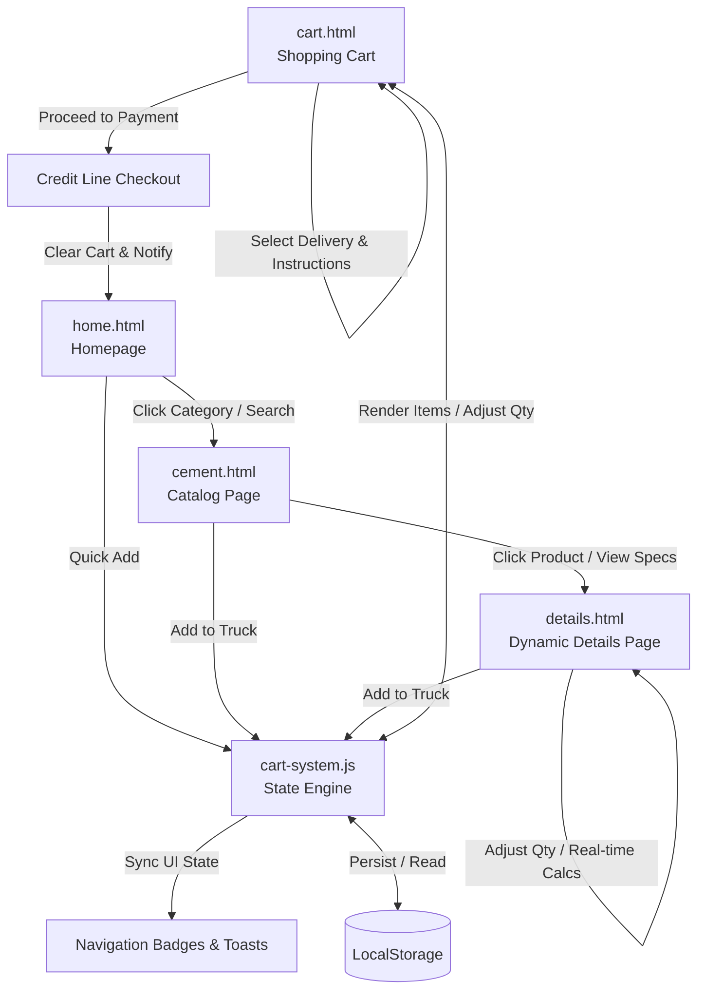

# BUILDERS' POINT DEPO LTD (BPD LTD) - Procurement System Integration Walkthrough

We have successfully integrated the static pages of **BUILDERS' POINT DEPO LTD (BPD LTD)** into a fully connected, highly interactive, and client-side dynamic e-commerce prototype. 

The entire procurement system is driven by a custom light-weight state machine ([cart-system.js](file:///c:/Users/jonat/OneDrive/Desktop/BUILDERS%27%20POINT%20DEPO%20LTD/cart-system.js)) that handles local storage persistence, synchronized navigation badges, real-time loading calculations (tonnage), dynamic catalog filtering, URL query parameter-based detail injection, and a realistic credit line checkout flow.

---

## 🏗️ System Architecture & Dynamic Flow

Below is a diagram illustrating how the pages are connected and how data flows through the local storage state engine:

---

## 🛠️ Integrated Components & Enhancements

### 1. ⚙️ Central State & UI Sync Engine ([cart-system.js](file:///c:/Users/jonat/OneDrive/Desktop/BUILDERS%27%20POINT%20DEPO%20LTD/cart-system.js))
- **Local Storage Client-Side Store:** Stores the cart state securely across page navigation and refresh.
- **Dynamic Toast System:** Displays responsive, industrial-styled toast messages in the bottom-right corner whenever a product is added or removed.
- **Real-Time Badge Sync:** Automatically updates shopping cart icons in both the **desktop top bar** and **mobile bottom navigation bar** with the exact number of units loaded.
- **Bonus Premium Theme Handler:** Persists dark/light mode preference across the entire application using local storage and coordinates smooth theme class switching.

### 2. 🏠 Homepage ([home.html](file:///c:/Users/jonat/OneDrive/Desktop/BUILDERS%27%20POINT%20DEPO%20LTD/home.html))
- **Live Category Grid:** Clicking categories routes directly to `cement.html` with corresponding URL filter parameters (e.g. `?category=steel` or `?category=aggregates`).
- **Interactive Quick Add:** Allows trade operators to load key featured materials (like Rebar or Ready-mix concrete) straight into their procurement truck without leaving the homepage, displaying immediate toast feedback.

### 3. 🔍 Catalog & Search ([cement.html](file:///c:/Users/jonat/OneDrive/Desktop/BUILDERS%27%20POINT%20DEPO%20LTD/cement.html))
- **Unified Product Registry:** Utilizes a dataset of premium heavy-duty construction products with dynamic rendering.
- **Real-Time Filters & Search:** Filtering by categories, brands, grades, packing type, weight range, and stock status are handled instantly. 
- **Sort & Grid System:** Supports instant sorting by SKU or price, dynamically regenerating the product grid layout.
- **Product Details Routing:** Clicking product cards routes to `details.html?id=<product_id>` with clean navigation parameters.

### 4. 📄 Dynamic Product Details ([details.html](file:///c:/Users/jonat/OneDrive/Desktop/BUILDERS%27%20POINT%20DEPO%20LTD/details.html))
- **URL Param Parser:** Reads `?id=<id>` automatically on page load to pull specifications, descriptions, prices, weights, badges, and image cards.
- **Interactive Calculations:** Standard pricing and load calculations (total weight in tonnes) update in real-time as users adjust the quantity counter.
- **Dynamic Spec Tables:** Generates complete industrial technical specifications tables on-the-fly for every structural product.

### 5. 🛒 Shopping Cart & Site Logistics ([cart.html](file:///c:/Users/jonat/OneDrive/Desktop/BUILDERS%27%20POINT%20DEPO%20LTD/cart.html))
- **Dynamic Cart Layout:** Adapts automatically to render empty state alerts or live lists of loaded items.
- **Tonnage & Load Calculations:** Shows a dedicated weight panel assessing cumulative tonnage to assist operators in logistics planning.
- **Logistics Delivery Scheduling:** Allows users to choose between next-day or scheduled slots, dynamically modifying delivery surcharges, VAT (20%), and grand totals in real-time.
- **Trade Procurement Gateway:** Proceeding to payment prompts a secure credit check modal, clears the cart upon submission, and gracefully redirects the user to the homepage.

### 6. 🛡️ Recent Architectural Enhancements
- **Global Currency Standardization (GH₵):** All platform pricing, static delivery surcharges, dynamic calculations, and admin inventory metrics have been standardized to Ghanaian Cedis (`GH₵`), fully localized and formatted to 2 decimal places.
- **Stealth Admin Management Portal ([admin.html](file:///c:/Users/jonat/OneDrive/Desktop/BUILDERS%27%20POINT%20DEPO%20LTD/admin.html)):** To maintain complete public stealth, all external links, footer links, and drawer items leading to the admin portal have been purged. Access is strictly via direct URL (`/admin.html`), protected by an industrial PIN security gateway (`newman7890` or `bpdadmin`).
- **Multi-Image Local File Dropzone:** In the admin product creation modal, the legacy URL text field was replaced with an advanced HTML5 drag-and-drop multi-file uploader (`<input type="file" multiple>`). It includes client-side FileReader and canvas compression (converting images to optimized 800px WebP at 80% quality) allowing dozens of high-quality product images to be stored safely within standard browser `localStorage` quotas.
- **Dynamic Angle Gallery:** `details.html` dynamically renders thumbnail galleries whenever a product has multiple uploaded images.
- **Brand Logo Integration:** The newly uploaded architectural brand logo (`logo.png`) has been embedded into the top navigation header and footer brand column across all pages, equipped with a clean white backing pad to ensure premium visibility across both light and dark modes.

---

## 🚀 Verification and Navigation Steps

Follow these steps to experience the complete BPD LTD Procurement system:
1. **Open the Homepage:** Launch [home.html](file:///c:/Users/jonat/OneDrive/Desktop/BUILDERS%27%20POINT%20DEPO%20LTD/home.html) in your browser.
2. **Add from Homepage:** Scroll to **Featured Materials** and click **Quick Add** on the **Steel Rebar** card. You will see a premium toast notification and the shopping cart badge will increment to `1`.
3. **Filter and Browse:** Click **Shop** in the top/bottom bar to open the catalog ([cement.html](file:///c:/Users/jonat/OneDrive/Desktop/BUILDERS%27%20POINT%20DEPO%20LTD/cement.html)). Use the sidebar or quick-filters to toggle between materials like **Aggregates** or **Construction Steel**.
4. **Inspect Specifications:** Click **View Specs** on **C40 Ready-Mix Concrete Blocks**. You will be taken to [details.html](file:///c:/Users/jonat/OneDrive/Desktop/BUILDERS%27%20POINT%20DEPO%20LTD/details.html) with full block details loaded. Increment the quantity and observe the weight scaling dynamically!
5. **Manage Cart:** Click **Add to Truck**, then go to the cart ([cart.html](file:///c:/Users/jonat/OneDrive/Desktop/BUILDERS%27%20POINT%20DEPO%20LTD/cart.html)). Adjust item counts, add site delivery instructions, change delivery options, and submit your order.
